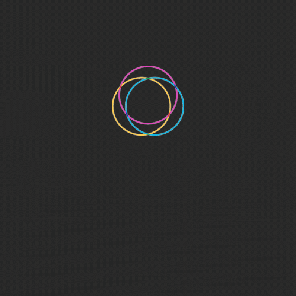

 
## **WOKE** is a static analyzer and symbolic execution engine for Solidity written in Python 🐍
 
  
 
 #
  

   
    

 
**developed by [Ackee Blockchain](https://ackeeblockchain.com)**

 #
 

- [📌 Core Features](#-core-features)

- [💾 How to Install](#-how-to-install)

- [📆 Roadmap](#-roadmap)

- [🚀 Contribution](#-contribution)

- [🍼 Getting Help](#-getting-help)

# 📌 Core Features

- ### WOKE console

Woke console provides an interface for interaction with compiled smart contracts so auditors can write tests tailored to the audited code 
and effortlessly integrate custom vulnerability detectors.

- ### WOKE IDE extensions

Woke extensions for IDEs add advanced support for Solidity by implementing Language Server Protocol. Developers can use their favorite IDE to effectively write Solidity code with features like auto-completion or “Go to the definition”.

- ### WOKE symbolic execution
    
Woke symbolic execution engine observes function behavior by forwarding symbolic parameters. Combined with static analysis, more detailed results and suggestions can be reported to developers.
    

- ### WOKE detectors

Integrated detectors can report complicated re-entrancy and access
control bugs - the source of many security breaches nowadays.

# 💾 How to Install

Lorem ipsum dolor sit amet, consectetuer adipiscing elit. Cras elementum. Nullam sapien sem, ornare ac, nonummy non, lobortis a enim. Fusce dui leo, imperdiet in, aliquam sit amet, feugiat eu, orci. Sed convallis magna eu sem. Neque porro quisquam est, qui dolorem ipsum quia dolor sit amet, consectetur, adipisci velit, sed quia non numquam eius modi tempora incidunt ut labore et dolore magnam aliquam quaerat voluptatem. Quisque porta. Curabitur sagittis hendrerit ante. Ut tempus purus at lorem. Etiam neque. Pellentesque ipsum. Donec quis nibh at felis congue commodo. Cum sociis natoque penatibus et magnis dis parturient montes, nascetur ridiculus mus. Curabitur ligula sapien, pulvinar a vestibulum quis, facilisis vel sapien. Aliquam in lorem sit amet leo accumsan lacinia. Integer pellentesque quam vel velit. Maecenas aliquet accumsan leo.

# 📆 Roadmap  

- **Q2/22**

- [ ] First public release including:
- [ ] Woke console
- [ ] Basic symbolic execution
- [ ] First package of vulnerability detectors
- [ ] VS Code extension

- **Q4/22**

- [ ] Advanced symbolic execution
- [ ] More IDE extensions 

# 🍼 Getting Help 

Lorem ipsum dolor sit amet, consectetuer adipiscing elit. Cras elementum. Nullam sapien sem, ornare ac, nonummy non, lobortis a enim. Fusce dui leo, imperdiet in, aliquam sit amet, feugiat eu, orci. Sed convallis magna eu sem. Neque porro quisquam est, qui dolorem ipsum quia dolor sit amet, consectetur, adipisci velit, sed quia non numquam eius modi tempora incidunt ut labore et dolore magnam aliquam quaerat voluptatem. Quisque porta. Curabitur sagittis hendrerit ante. Ut tempus purus at lorem. Etiam neque. Pellentesque ipsum. Donec quis nibh at felis congue commodo. Cum sociis natoque penatibus et magnis dis parturient montes, nascetur ridiculus mus. Curabitur ligula sapien, pulvinar a vestibulum quis, facilisis vel sapien. Aliquam in lorem sit amet leo accumsan lacinia. Integer pellentesque quam vel velit. Maecenas aliquet accumsan leo.

# 🚀 Contribution

Thank you for your interest in contributing to Trdelnik! All contributions are welcome no
matter how big or small. This includes (but is not limited to) filing issues,
adding documentation, fixing bugs, creating examples, and implementing features.

If you'd like to contribute, please claim an issue by commenting, forking, and
opening a pull request, even if empty. This allows the maintainers to track who
is working on what issue as to not overlap work. 

If you're considering larger changes or self motivated features, please file an issue
and engage with the maintainers in [Discord](https://discord.com/invite/h3zeeCbHYT).

# License
This project is licensed under the [MIT license](https://github.com/Ackee-Blockchain/woke/blob/main/LICENSE).
                                               
